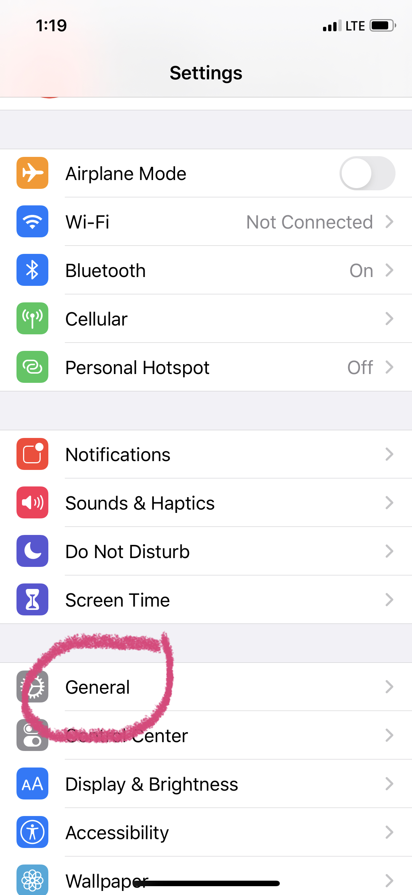
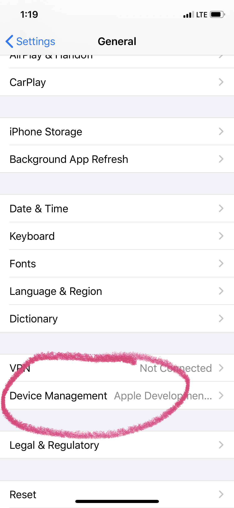
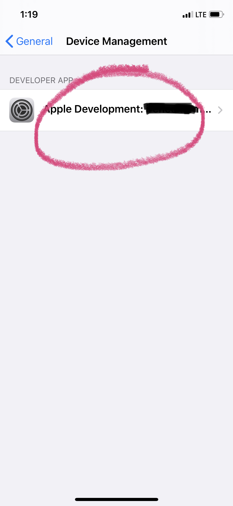
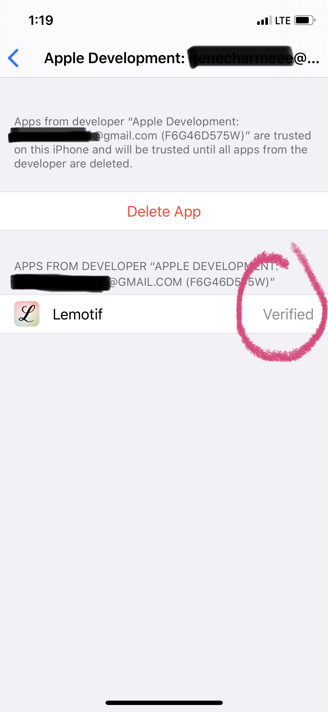

# Lemotif: Affective Visual Journal - IOS Application Framework

This IOS application is based on the [Lemotif Project](https://github.com/xaliceli/lemotif). 
This project aims to provide a user friendly interface for Lemotif on IOS served devices. Currently, the application relies on api calls to the [web server](http://lemotif.cloudcv.org/) for Lemotif. Because this backend is not scalable, the application has not been published in the app store. However, the project provides a framework for future use with a more scalable backend, such as one using Core ML. 

## Some Features of the Application
1. There are two tabs, one for generating a new journal, and the other for past journal entries.
2. In the first tab, one can enter up to three journal entries. Upon clicking on `Generate Motifs` button, one can customize the motif style. Then clicking on the `Generate Motifs` again, motifs are generated.
3. Generated motif can be saved or the user can simply return to the start screen.
4. The saved model can be viewed on the second tab, which shows the list of previously generated models. Clicking on one of them will show detailed information about the selected entry.

The application can be simulated via Xcode on MacOS supported devices and loaded locally on a phone by selecting the device connected to computer as a simulator. 

In order to load the application on a phone locally, the following setup is needed.
1. trust the selected device - there should be a pop up window when first trying to run the application on the phone. 
2. Verify the application in `Settings` The following pictures demonstrate how to do so.
  
  
  
  
  
